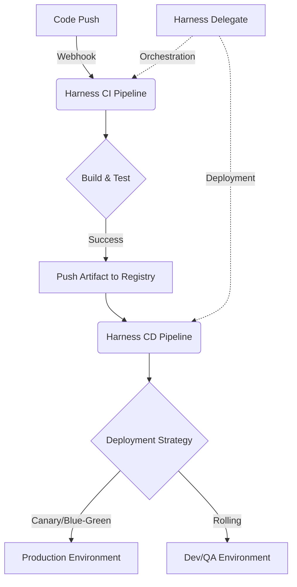

# CI/CD 아키텍처

이 문서는 Harness를 기반으로 한 CI/CD 아키텍처를 설명합니다.

## CI/CD 프로세스 흐름 (Mermaid Diagram)

## 전체 흐름
1. **코드 커밋**: 개발자가 코드를 Git 저장소에 푸시합니다.
2. **CI 트리거**: 웹훅을 통해 Harness CI 파이프라인이 트리거됩니다.
3. **빌드 및 테스트**: 코드가 컴파일되고 유닛 테스트 및 정적 코드 분석이 수행됩니다.
4. **아티팩트 생성**: 빌드된 아티팩트(예: Docker 이미지)가 레지스트리에 푸시됩니다.
5. **CD 트리거**: 아티팩트가 생성되면 Harness CD 파이프라인이 트리거됩니다.
6. **배포**: 대상 환경(Dev, QA, Prod)에 아티팩트가 배포됩니다.

## 인프라 구성요소 (Connectors 중심)
- **Source Control Manager (SCM)**: GitHub / GitLab / Bitbucket
- **Harness Platform**: SaaS 기반 파이프라인 관리 및 오케스트레이션
- **Harness Delegate**: 프라이빗/퍼블릭 인프라 내 실행 에이전트
- **Artifact Registry**: Docker Hub, AWS ECR, GCP GCR, Artifactory
- **Target Environments**: Kubernetes(K8s), AWS ECS/Lambda, EC2, Azure
